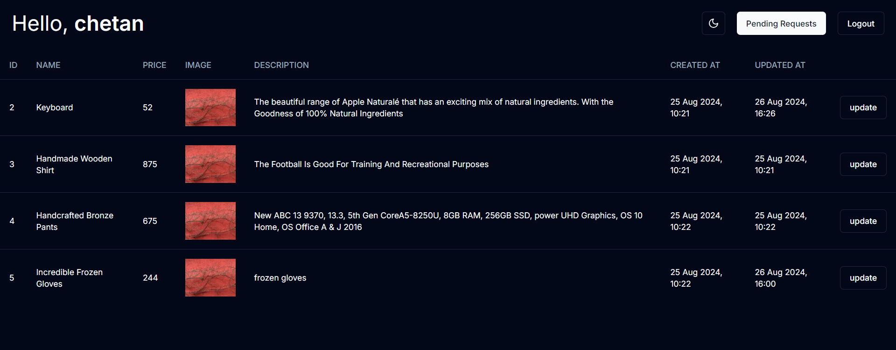

<!-- ABOUT THE PROJECT -->
# Plypicker Product Management System
### dashboard


This is a task assigned for an internship at Plypicker. The project is a product management system designed for admins and team members to collaborate on product updates efficiently. The application is built using Next.js and TypeScript, with MongoDB for data storage.
Use the `README.md` to get started.


<h2>Features</h2>
<ul>User Authentication: Secure login and registration for both admins and team members.</ul>
<ul>Role-Based Access Control: Admins can manage products and review submissions, while team members can submit and track their changes.</ul>
<ul>Product Management: View, update, and manage product details.</ul>
<ul>Submission Tracking: Team members can track their submissions, and admins can review and approve/reject them.</ul>

<h2>Pages</h2>
<li>/register: User registration page.</li>
<li>/login: User login page.</li>
<li>/dashboard: Dashboard for both admins and team members (content varies based on role).</li>
<li>/product/: Detailed view of a product.</li>
<li>/profile: User profile page.</li>
<li>/profile/my-submissions: Submissions made by the team member (accessible only to team members).</li>
<li>/pending-requests: List of pending requests for admins to review.</li>
<li>/pending-requests/requestId: Detailed view of a specific request, including changes made (accessible only to admins).</li>


<!-- BUILT WITH -->
<h2>Built With</h2>
The Tech Stacks used are:

<div align="center">
  <a href="https://skillicons.dev">
      
  </a>
</div>

## Installation

1. Clone the repository to your local machine:

   ```bash
   git clone https://github.com/Chetan3327/plypicker.git
   ```
2. Navigate to the directory:

   ```bash
   cd plypicker
   ```
3. Install dependencies:

   ```bash
   npm install
   ```
4. run the development server:

   ```bash
   npm run dev
   ```

<!-- CONTACT -->
# Contact

<ul>
   <li>Name: Chetan Chauhan</li>
   <li>Mail: chauhanchetan12789@gmail.com</li>
   <li>Linkedin: https://www.linkedin.com/in/chetan3327/</li>
   <li>Project Link: https://plypicker3327.vercel.app/</li>
</ul>
